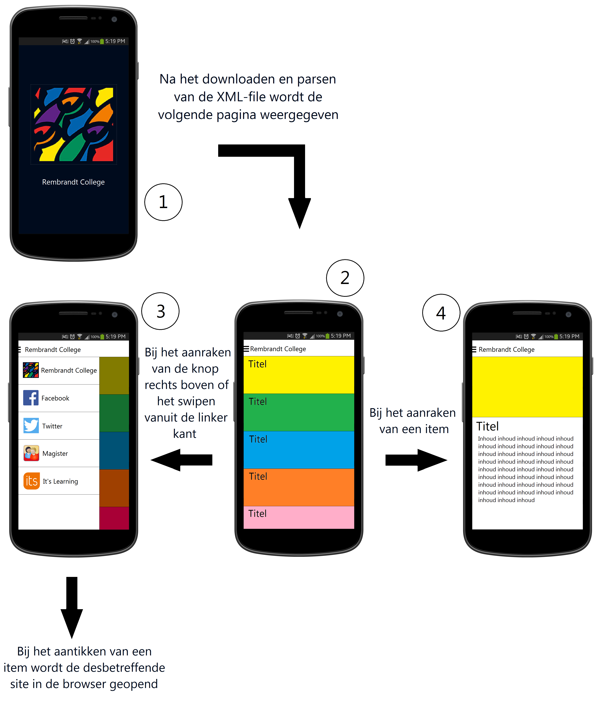

Design Document
===

Classes and Functions
---

- NewsActivity: Maakt onClickListeners aan, zorgt dat de Navigation Drawer kan worden geopend met de knop in de ActionBar.
	- startInternetActivity: Start de browser met een meegegeven url.
	- hasInternetConnection: Kijkt of er een internetverbinding aanwezig is. Returns true of false.
- DownloadWebPageTask: Kijkt of er een internetverbinding is. Als dat zo is roept hij downloadFromUrl aan. Daarna wordt de functie getEntries aangeroepen.
	- downloadFromUrl: Maakt een verbinding met de server en download de XML file als deze niet up to date is.
	- downloadPictures: Checkt welke afbeeldingen er nog niet in de cache zitten, maakt eventueel een verbinding met internet en download de afbeeldingen.
	- getEntries: Parsed de XML. Roept getItem aan.
	- getItem: Parsed één enkel item in de XML file (titel, content en foto url). Roept getTitle, getContent en getImage aan.
	- getTitle: Pakt de text uit de <title> tag.
	- getContent: Pakt de text uit de <content:encoded> tag. Decodeerd te text met ISO-8859-1 en codeerd het daarna in UTF-8.
	- getImage: Haalt de text de <guid> tag en maakt hier een (string) url van.
	- skip: Laat de parser een tag skippen uit de XML file.

	

API's and frameworks
---
.
- android.graphics: Om gebruik te maken van bitmaps, het bewerken van fotos.
- FileInputStream/FileOutputStream: Om de XML file te downloaden.
- android.content: Intents worden gebruikt om sites te starten vanuit de app.
- android.os.AsyncTask: Om de XML file en fotos in de achtergrond te downloaden.
- android.support.v7.app.ActionBarActivity: Om in oudere versier van android de ActionBar aan te kunnen passen.
- org.xmlpull.v1.XmlPullParser: Om de XML file te kunnen parsen.
- java.io.File: Om de XML file en de fotos op te kunnen slaan in de cache.
- java.net.HttpURLConnection: Om een verbinding te kunnen leggen met de server.

Mockup
---

